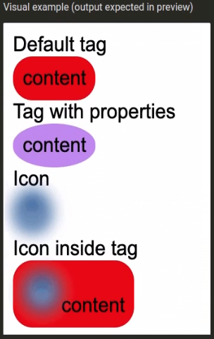

# Task 002

## Problem:

- Your task is to implement two components using `Styled Components` in React.

- Requirements

  - Use `Styled Components` to define both components. Don't create any new React components, it's unnecessary.

  - Tag component

    - 1. Accept two properties: `color` (default value: `red`) and `borderRadius` (default value: `1em`).

    - 2. The Tag component should use a `span` element.

    - 3. The Tag component should have:

      - display equal to `inline-block`;
      - padding equal to `0.5em`;
      - background color equal to the `color` property;
      - border radius equal to the `borderRadius` property.

  - Remember to export your component with the name `Tag`, as it's necessary for the tests to pass.

  - Icon component

    - 1. The Icon component should use an `img` element.
    - 2. The Icon component should be blurred (6px blur).
    - 3. If the Icon component is used inside the Tag component, remove the blur while hovering over the icon (using `Styled Components`).

  - Remember to export your component with the name `Icon`, as it's necessary for the tests to pass.

  - Available tools/packages

    - JavaScript ES2020
    - `Styled Components` v5.2.1

  - Examples

    - 

      - .png>)

    - Example usage of the Tag component:
      ```
      <Tag color="orange" borderRadius="6px">Trending</Tag>
      ```
    - Example usage of the Icon component:

      ```
      <Icon src="someIcon.webp" alt="" />
      ```

    - Example usage of both components:
      ```
      <Tag color="blue">
        <Icon src="icon.png" alt="" />
        New
      </Tag>
      ```

  ```
  import Styled from "styled-components";

  // Use console.log() and browser console for debugging

  export const Tag = styled.div``;

  export const Icon = styled.div``;
  ```
